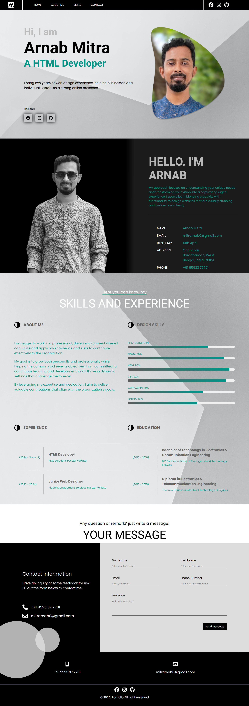

# 🚀 Navbar Toggle & Active State Management

This project implements a responsive navigation bar with toggling functionality and active state management. The navbar includes a social links section and dynamically updates the active link when navigating between pages.

## 📌 Features
- Responsive Navbar with a Toggler Button
- Automatic "Home" Link Activation on Toggle Click
- Active State Management for Navigation Links
- Click Outside to Close Navbar
- Dynamic Footer Year Update

## 🛠️ Technologies Used
- HTML
- CSS
- JavaScript

## 📸 Screenshot

## 🎯 Functionality Breakdown
- Clicking the navbar toggler opens and closes the menu.
- When toggled, the "Home" link is automatically set as active.
- Clicking any navbar link highlights it as active and closes the menu.
- Clicking outside the navbar will close it.
- The footer dynamically displays the current year.

## 📞 Contact
For any queries or contributions, feel free to reach out!

---
💡 *Happy Coding!* 🎉

